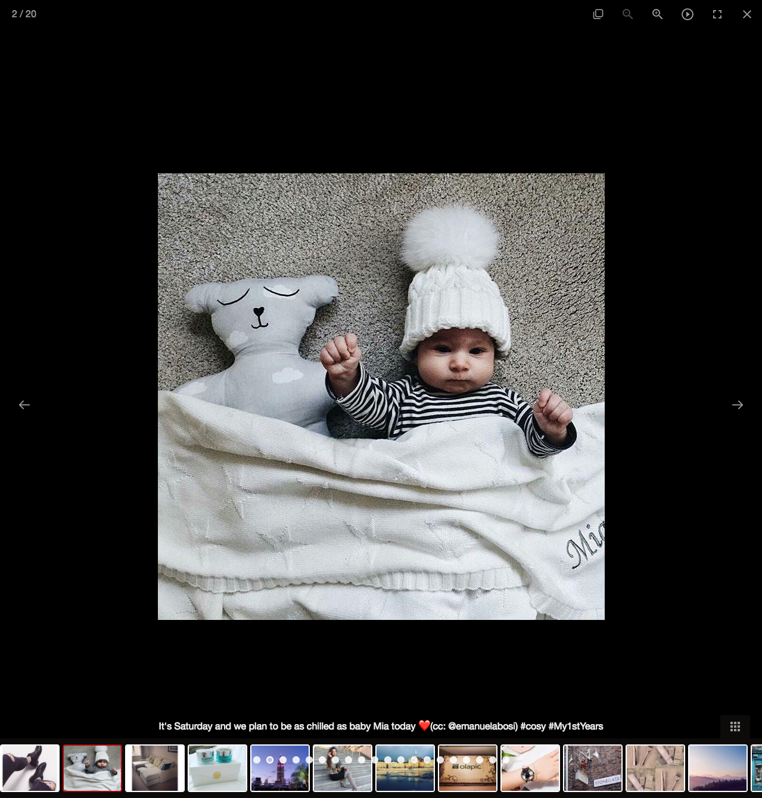

# Olapic SA role - gallery demo

This repo contains a demo page showing integration with Olapic's "media" API. You can see it in action [here](https://adriandugan.github.io/olapic_sa_demo/).

The demo uses jQuery [v3.1.1] and hooks up to [LightGallery](https://github.com/sachinchoolur/lightGallery), which is feature-rich, providing a gallery 
view with carousel, auto-play, mouse & keyboard controls and it's HTML5 
responsive. :-) I have never used this particular gallery plugin before but 
reviewing several others - and considering writing my own - showed 
LightGallery to be a good choice here.

---

## Accessing the data

I followed the Olapic API docs, calling auth to ensure my token is valid
and then grabbing the [default] 'recent' "media" endpoint from the auth
response. This follows the API recommendations as it ensures Olapic
retains complete control of the URLs.

Your docs explain how to vary the number of results (which defaults to 20)
but I failed to see how to "paginate" i.e. retrieve page 2, 3, 4 (with 20
results per page). See: http://apiv2-docs.photorank.me/index.html#header-pagination

## Improvements

### display more data

I had planned on pulling back the next page as you scroll through the results
by utilising AJAX get requests - but see above note on 'pagination'.

update: I have now found how to do this: `page_key`.

### improve error handling

I would add more error handling to the demo but I didn't give myself enough
time to add more than [what I consider the most] basic error handling.
